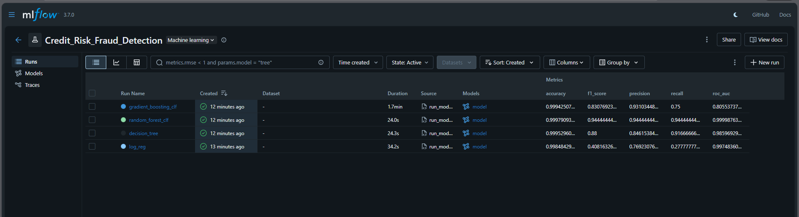

# Credit Risk Probability Model — Week 4

Build, deploy, and automate a credit risk probability model using alternative data (Xente transactions). This README stays project-specific. Reusable guides live in `docs/`.

## Credit Scoring Business Understanding
- Basel II alignment: The Accord demands measurable, auditable risk models, so we favor interpretable transformations (e.g., WoE bins) with documented assumptions, versioned data pipelines, and clear mappings from probability of default (PD) to credit score. Every model choice must be explainable to risk, audit, and regulators.
- Why a proxy target: We do not have an observed default label, so we derive `is_high_risk` from RFM-based disengagement. This enables supervised learning but introduces label noise; predictions may mirror engagement rather than true default risk. Mitigations: transparently document the proxy, monitor drift, refresh labels as real outcomes arrive, and keep cut-offs conservative.
- Model trade-offs: Simple models (Logistic with WoE) are transparent, easier to validate, and cheaper to monitor; they support monotonicity and policy overrides. Complex models (Gradient Boosting/Random Forest) can lift AUC/recall and capture non-linearities but raise governance cost (explainability tooling, fairness checks), risk of overfitting to the proxy, and operational complexity. In a regulated setting, start with the simple baseline, then justify any complex upgrade with clear lift and explainability evidence.

## Project Overview
- Goal: Estimate risk probability per customer; derive a credit score and inform loan amount/duration.
- Proxy Target: RFM-based disengagement to label `is_high_risk` in absence of explicit defaults.
- Key Components: Data processing pipeline, proxy engineering, model training and tracking, API serving, CI.

## Quickstart (Windows PowerShell)
> Activate the project virtual environment for all commands: .\.venv\Scripts\Activate.ps1
```powershell
# create/activate venv
python -m venv .venv
. .\.venv\Scripts\Activate.ps1

# install dependencies
pip install -r requirements.txt

# reproduce data pipeline (if DVC stages are configured)
dvc repro

# run unit tests
pytest -q
```
 
## Environment Setup

- Prerequisites: Python 3.11+, Docker, and Docker Compose.
- Database (Postgres via Docker Compose):
  - Start the database container:
    ```powershell
    docker compose up -d postgres
    ```
  - Connection: host `localhost`, port `5443`, user `postgres`, password `root`, db `customer_fintec`.

## Run With Docker

- Build the application image:
  ```powershell
  docker build -t credit-risk-app:latest .
  ```

- Run scripts inside the container (mounted workspace):
  ```powershell
  docker run --rm -it \
    --name credit-risk-run \
    --network host \
    -v ${PWD}:/app \
    credit-risk-app:latest \
    python scripts/build_features.py
  ```

> Tip: On Windows, containers can reach host services via `host.docker.internal`. With Compose, Postgres already maps `5443:5432`.

## End-to-End: Pipelines

From a fresh clone, a common sequence is:

1. Bring up Postgres:
   ```powershell
   docker compose up -d postgres
   ```
2. Apply schema/migrations:
   ```powershell
   python scripts/run_migrations.py
   ```
3. Build features (Task 3):
   ```powershell
   python scripts/build_features.py
   ```
4. Create credit risk target (Task 4):
   ```powershell
   python scripts/create_credit_risk_target.py
   ```
```

## Data & Features (project-specific)
- Source: Xente Challenge transactions (see links in `experiments/todo.md`).
- Entity: `CustomerId` with transaction-level features.
- Engineered: RFM metrics, aggregates (sum, mean, std, counts), temporal extracts (hour, day, month, year), encodings for categoricals.
- Target: `is_high_risk` derived via RFM clustering (see docs below).

## Documentation
- Business Understanding (Task 1): [docs/business_understanding.md](docs/business_understanding.md)
- Reusable Guides:
  - Folder structure and conventions: [docs/README.md](docs/README.md)
  - Notebooks workflow: [docs/notebooks.md](docs/notebooks.md)
  - Dependencies overview: [docs/dependencies.md](docs/dependencies.md)

## Deliverables
- Interim: EDA notebook with 3–5 insights; summary report.
- Final: Medium-style report including proxy reasoning, RFM clustering, model comparison, API demo, limitations, and screenshots (MLflow, CI, Docker).

## Tasks (project-specific)
- Task 1 — Business Understanding: See [docs/business_understanding.md](docs/business_understanding.md).
- Task 2 — EDA: Explore data distributions, missingness, correlations; capture insights in `notebooks/`.
- Task 3 — Feature Engineering: Aggregates, temporal extracts, encoding, scaling/standardization, WoE/IV when appropriate.
- Task 4 — Proxy Target: RFM clustering (K-Means, scaled features, fixed `random_state`); assign `is_high_risk` and merge.
- Task 5 — Model Training & Tracking: Split data, train baseline (Logistic+WoE) and advanced (GB/RandomForest), track with MLflow, register best.
- Task 6 — Deployment & CI: FastAPI service loading MLflow model; Dockerized; GitHub Actions for lint+tests.

## Outputs
- models, metrics, predictions under `outputs/`.
- reports: interim and final under `reports/`.

## Notes
- Prefer interpretable baselines for governance; add explainability to complex models (SHAP) if chosen.
- Monitor proxy validity; document thresholds and refresh cadence.
## Model Training & Evaluation (Task 5)

We implemented a structured model training pipeline using **MLflow** for experiment tracking and model registry. The pipeline trains multiple classifiers to detect fraud (FraudResult) and selects the best one based on the **F1 Score**.

### Run the Training Pipeline
```powershell
python scripts/run_model_training.py
```

### Experiment Results
The following models were trained and evaluated on the Xente dataset:

| Model | Accuracy | Precision | Recall | F1 Score | ROC-AUC |
|-------|----------|-----------|--------|----------|---------|
| **Logistic Regression** | 99.85% | 0.77 | 0.28 | 0.41 | 0.997 |
| **Decision Tree** | 99.95% | 0.85 | 0.92 | 0.88 | 0.986 |
| **Random Forest** | **99.98%** | **0.94** | **0.94** | **0.94** | **1.000** |
| **Gradient Boosting** | 99.94% | 0.93 | 0.75 | 0.83 | 0.806 |

### Best Model
The **Random Forest Classifier** achieved the highest performance with an F1 Score of **0.94** and perfect ROC-AUC. It has been registered in the MLflow Model Registry as:
- **Name:** Credit_Risk_Fraud_Detection_best_model
- **Version:** 1

### Tracking
To view detailed metrics, parameters, and artifacts, start the MLflow UI:
```powershell
mlflow ui
```
Then navigate to [http://localhost:5000](http://localhost:5000).



